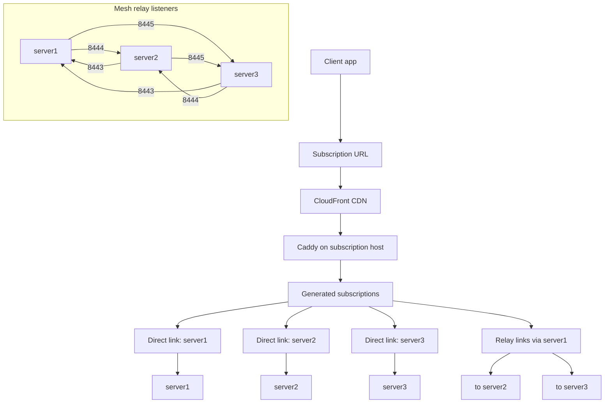

# xray-relay-mesh

`xray-relay-mesh` is a Bash-based deployment toolkit for a small Xray mesh:

- `deploy/` provisions and updates Xray on each node
- `relay/` renders and deploys per-node HAProxy relay configs
- `subs/` generates per-user subscription files and syncs them to a Caddy host
- `certs/` creates and tears down the AWS CloudFront + ACM + Route53 setup used in front of the subscription server
- `mesh.sh` is the single entrypoint for operators

The repo is inventory-driven. You describe nodes, users, relay ports, and subscription settings in one `inventory.json`, then render and push everything from there.

## What it manages

Each node can run two layers:

1. Xray on that node's own `direct_port`
2. HAProxy listeners for every other node in the mesh, using deterministic relay ports derived from `relay_port_base + node.id`

Separately, one Caddy host serves generated subscription files. That host can optionally sit behind CloudFront with a custom origin verification header.

## Repository layout

```text
mesh.sh                      Interactive/operator entrypoint
lib/                         Shared SSH, logging, and inventory helpers
deploy/                      Xray deployment
relay/                       HAProxy mesh deployment and rollback
subs/                        Subscription generation and sync
caddy/                       Caddy subscription server deployment
certs/                       AWS CDN setup and teardown
remove-node/                 Inventory decommission helper
examples/                    Example inventory files
```

## Requirements

Local tools used by the scripts:

- `bash`
- `jq`
- `ssh`
- `scp`
- `rsync` for subscription sync
- `curl`
- `sha256sum`
- `base64`
- `docker` locally only if Reality keys are missing and need to be generated automatically
- `aws` CLI for `certs/setup_cdn_cert.sh` and `certs/destroy_cdn_cert.sh`
- `qrencode` is optional for QR outputs during subscription generation

Remote hosts:

- SSH access with the per-node `ssh_user` / `ssh_key` declared in inventory
- `sudo` on the target hosts
- Docker and Docker Compose plugin will be installed automatically if missing

## Inventory

The default inventory path is `./inventory.json`. Example schemas live in:

- [examples/inventory.2node.json](/Users/siarhei/Sources/xray-relay-mesh/examples/inventory.2node.json)
- [examples/inventory.3node.json](/Users/siarhei/Sources/xray-relay-mesh/examples/inventory.3node.json)

Main sections:

- `relay_port_base`: base port used to derive relay listeners as `base + node.id`
- `resolvers`: HAProxy DNS resolver settings
- `subs`: subscription domain, Caddy host, deployment dir, SSH settings, and secrets
- `xray.reality`: shared Reality keys and SNI for all nodes
- `xray.users`: subscription users, UUIDs, and optional per-user hidden nodes
- `nodes`: mesh members with stable `id`, `name`, `host`, `direct_port`, SSH settings, and optional `is_relay_entry`

Important invariants enforced by the tooling:

- node `id` values must be unique and should never be reused after removal
- node `name` and `host` must not contain whitespace
- every node must declare `ssh_user` and `ssh_key`
- relay ports derived from `relay_port_base + id` must stay in range and not collide with peers' `direct_port`

## Quick start

1. Copy one of the example inventories to `inventory.json`.
2. Fill in:
   - real node hosts
   - per-node SSH credentials
   - `subs.domain`, `subs.caddy_host`, `subs.sub_secret`, `subs.origin_verify_secret`
   - `xray.users`

If `xray.reality.private_key` and `xray.reality.public_key` are empty, `deploy/deploy_nodes.sh` will generate them once locally with Docker and persist them back into `inventory.json`.

## Using `mesh.sh`

`mesh.sh` is the operator entrypoint. In normal use, start there instead of calling the scripts in `deploy/`, `relay/`, `subs/`, `caddy/`, or `certs/` directly.

Open the interactive UI:

```bash
./mesh.sh
```

The menu exposes the operational flow:

- deploy Xray to one node or all nodes
- deploy relay mesh config to one node or all nodes
- generate subscriptions locally
- sync subscriptions to the Caddy host
- deploy or update Caddy
- roll back relay config on one node
- remove a node from inventory
- set up or destroy the CDN certificate stack

`mesh.sh` also supports direct subcommands when you want to script the same actions:

```bash
./mesh.sh deploy-node <node_name>
./mesh.sh deploy-nodes
./mesh.sh deploy-relay <node_name>
./mesh.sh deploy-relay-all
./mesh.sh deploy-caddy
./mesh.sh subs-generate
./mesh.sh subs-sync
./mesh.sh rollback <node_name>
./mesh.sh remove-node <node_name>
./mesh.sh cert-setup
./mesh.sh cert-destroy
```

To use a different inventory file:

```bash
INVENTORY=./examples/inventory.2node.json ./mesh.sh
```


## Node lifecycle

To remove a node from the mesh bookkeeping:

```bash
./mesh.sh remove-node <node_name>
./mesh.sh deploy-relay-all
./mesh.sh subs-generate
./mesh.sh subs-sync
```

`remove-node/remove_node.sh` updates only the inventory. It does not shut down the old server.

To roll back HAProxy on one node:

```bash
./mesh.sh rollback <node_name>
```

## Notes

- The scripts are designed as push-model deploys from the local machine.
- Logging goes to stderr in shared helpers so command substitution remains safe.
 
## Example 3-node network

Simple view of a 3-server setup:

How to read it:

- `CloudFront / Caddy`: gives the client its subscription file
- `direct`: client connects straight to that node's `direct_port`
- `relay`: client connects to an entry node host on the relay port assigned to the target peer node

For `inventory.3node.json`:

- `server1` is the input node because it has `is_relay_entry: true`
- `server2` and `server2` are regular mesh nodes
- users get direct links to all visible nodes
- users also get relay links `via server1` for every peer of `server1`
- more generally, every relay entry node can communicate with all other nodes through its per-peer relay listeners

Mermaid version for GitHub rendering:



